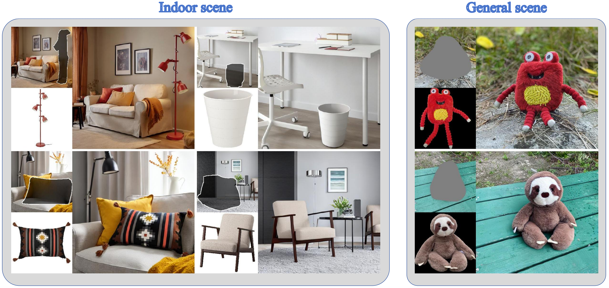

# [NeurIPS 2025] RoomEditor: High-Fidelity Furniture Synthesis with Parameter-Sharing U-Net



## 🔥 Updates

[2025/12/22] Release the RoomEditor++ model, the RoomBench++ dataset. [PDF](https://arxiv.org/abs/2512.17573)

[2025/12/15] Release the RoomEditor model, the RoomBench dataset, and the evaluation code.

## Requirements

To install requirements:

```setup
pip install -r requirements.txt
```

To install RoomEditor++ requirements:
```setup
pip install -r RoomEditor++/requirements.txt
```


## Download Checkpoints 
If you need the all train data, please sent email to contact us.

Download SD-1.5-inpainting checkpoint: 

* You could download it from HuggingFace [stable-diffusion-inpainting](https://huggingface.co/stable-diffusion-v1-5/stable-diffusion-inpainting)

Download Roomeditor: 

* You could download the model weights and test images from  [here](https://share.multcloud.link/share/74f20132-4269-41d0-8355-0c39106de6b0)
  

Download Roomeditor++: 

* You could download the model weights and test images from  [here](https://share.multcloud.link/share/74f20132-4269-41d0-8355-0c39106de6b0)


## Evaluation

Run inference with 

```eval
bash run.sh 
```

Run RoomEditor++ inference with 

```eval
python /root/autodl-fs/code/RoomEditor/RoomEditor++/inference.py
```

## Gradio Demo

You can run this script:

```setup
python run_gradio_demo.py
```

## Citation
```cite
@inproceedings{
lin2025roomeditor,
title={RoomEditor: High-Fidelity Furniture Synthesis with Parameter-Sharing U-Net},
author={Zhenyi Lin and Xiaofan Ming and Qilong Wang and Dongwei Ren and Wangmeng Zuo and Qinghua Hu},
booktitle={Advances in Neural Information Processing Systems},
year={2025}
}
```